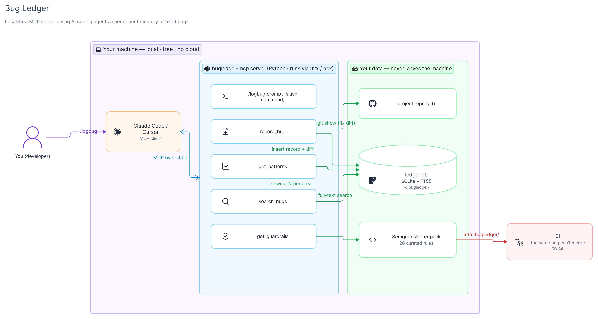

# Bug Ledger MCP

**Never fix the same bug twice.** A local-first [MCP](https://modelcontextprotocol.io) server that gives AI coding agents (Claude Code, Cursor, any MCP client) a permanent memory of fixed bugs. Record a bug at fix time; every future session checks the ledger before writing code.



Everything runs on your machine: one SQLite file in `~/.bugledger/`. No login, no cloud, no telemetry, no network calls.

## Install

Requires [uv](https://docs.astral.sh/uv/) (Python is downloaded automatically if needed).

```sh
claude mcp add bugledger -- uvx bugledger-mcp
```

Restart Claude Code. The tools and the `/mcp__bugledger__logbug` prompt appear.

**Cursor:** add to `.cursor/mcp.json`:

```json
{ "mcpServers": { "bugledger": { "command": "uvx", "args": ["bugledger-mcp"] } } }
```

**Whole team:** commit that same block as `.mcp.json` (Claude Code) or `.cursor/mcp.json` (Cursor) in each repo. Everyone who opens the project gets the server. Per repo, not per person.

## How it works

| Tool | The agent calls it… | What it does |
|---|---|---|
| `get_patterns(feature_area, project)` | **before** planning or coding in an area | Newest past bugs for that area, one line each (`symptom → root cause`), capped at 30 lines |
| `search_bugs(query)` | while debugging | Full-text search over symptoms and root causes. Paste the error; punctuation is ignored, best matches first |
| `record_bug(...)` | after a fix, once you confirm | Stores symptom, root cause, feature area, project, stack, severity, and the fix diff (`git show <commit>` or an agent-supplied hunk) |
| `list_areas()` | before naming things | Feature areas and projects already in the ledger, with counts, so names stay consistent |
| `resolve_bug(id, project)` | once a project has a guardrail | Hides that bug from `get_patterns` for that project only |
| `update_bug` / `delete_bug` | to correct mistakes | Edit or remove a record |
| `get_guardrails(stack)` | at project setup | The starter pack of Semgrep rules plus the CI workflow to add |

**`/logbug`** is an MCP prompt served by the server. It makes the agent check that the session really contained a bug fix, draft the record from the session, show it to you, and call `record_bug` only after you say yes. Feature work and refactors are refused.

The server also sends standing instructions to the agent on connect (call `get_patterns` before coding, `search_bugs` while debugging, `record_bug` after a confirmed fix), so it works without any extra setup. To make it a hard rule, add this to `CLAUDE.md` or `.cursorrules`:

```
Before implementing anything in a feature area, call bugledger get_patterns with that area and this project's name, and account for every returned bug. After fixing a bug, run /mcp__bugledger__logbug.
```

## Guardrails: the Semgrep starter pack

`get_guardrails` returns hand-written Semgrep rules for classic AI-coding mistakes: SQL and shell injection, hardcoded secrets, passwords in URLs, unsafe deserialization, `eval`, open CORS, debug mode, insecure random, empty catch blocks, plain-HTTP URLs. The agent writes them into `.bugledger/` in your repo and adds one new workflow file. Existing CI files are never touched.

ERROR-severity rules block the pull request. WARNING rules are advisory: printed, never failing the build. Delete a rule's file to drop it. Every rule ships with its own known-bad fixture and is tested with `semgrep --test` in this repo's CI.

## Data and privacy

- The ledger is `~/.bugledger/ledger.db`. Override the folder with `BUGLEDGER_HOME`. Back it up or delete it freely; it is recreated on next start.
- `record_bug` runs `git show <fix_ref>` in the server's working directory to store the fix diff locally. The diff is stored, never returned by `get_patterns`, and never sent anywhere.
- No telemetry. The server makes no network calls.

## Development

See [CONTRIBUTING.md](CONTRIBUTING.md) for the full workflow. The short version:

```sh
cd python
uv sync --group test
uv run pytest                                  # unit + end-to-end over the MCP protocol
uv run --group rules semgrep --test ../shared/rules --metrics=off   # rule pack self-test
uv run bugledger-mcp                           # start the server (waits silently on stdin)
```

Register the dev checkout in Claude Code with `claude mcp add bugledger -- uv run --directory /abs/path/to/bugledger-mcp/python bugledger-mcp`.

**Release:** bump `version` in `python/pyproject.toml`, then `python scripts/sync.py && cd python && uv build && uv publish`. Or publish a GitHub release; the `Publish` workflow does the same with the `PYPI_API_TOKEN` secret.

## Repo layout

```
shared/      schema SQL · Semgrep rules + fixtures · /logbug prompt text (single source for every runtime)
python/      canonical implementation → PyPI (uvx / pip)
typescript/  npm port (npx), added after the Python server proves itself in daily use
scripts/     sync.py copies shared/ into the package before a build
artifacts/   diagrams and images
```

## License

[MIT](LICENSE)
